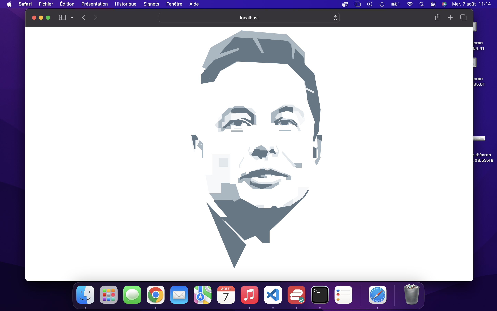

# APP Elon Musk

[](LICENSE)

Experience the art of CSS with a React app showcasing a detailed drawing of Elon Musk.   

## Description  

Welcome to Elon Musk CSS Portrait, a unique React application that demonstrates the potential of CSS art by recreating a detailed image of Elon Musk entirely through CSS. This project combines the power of React with advanced CSS techniques to showcase a stunning, pixel-perfect portrait, pushing the boundaries of what's possible with front-end development.  

Here an exemple of the CSS Portrait.  



## Table of Contents

- [Getting Started with Create React App](#Getting-Started-with-Create-React-App)
- [Launch Application](#Launch-Application)
- [Contributing](#Contributing)
- [License](#License)  

## Getting Started with Create React App

This project was bootstrapped with [Create React App](https://github.com/facebook/create-react-app).  

```bash
git clone https://github.com/HaDock404/app-drawing-elon_musk.git
cd app-drawing-elon_musk
npm install
```  

## Launch Application   

```bash
npm start
```  

Runs the app in the development mode.\
Open [http://localhost:3000](http://localhost:3000) to view it in your browser.

The page will reload when you make changes.\
You may also see any lint errors in the console.

## Contributing

Pull requests are welcome. For major changes, please open an issue first
to discuss what you would like to change.

Please make sure to update tests as appropriate.

## License  

This project is licensed under the MIT License - see the [LICENSE](./LICENSE) file for details.